# Enfos reporting portal

An internal reporting portal: pick a report from a landing page, then sort, filter,
search, and page through it. Adding a new report is one backend module and a seed file 
no frontend change required.

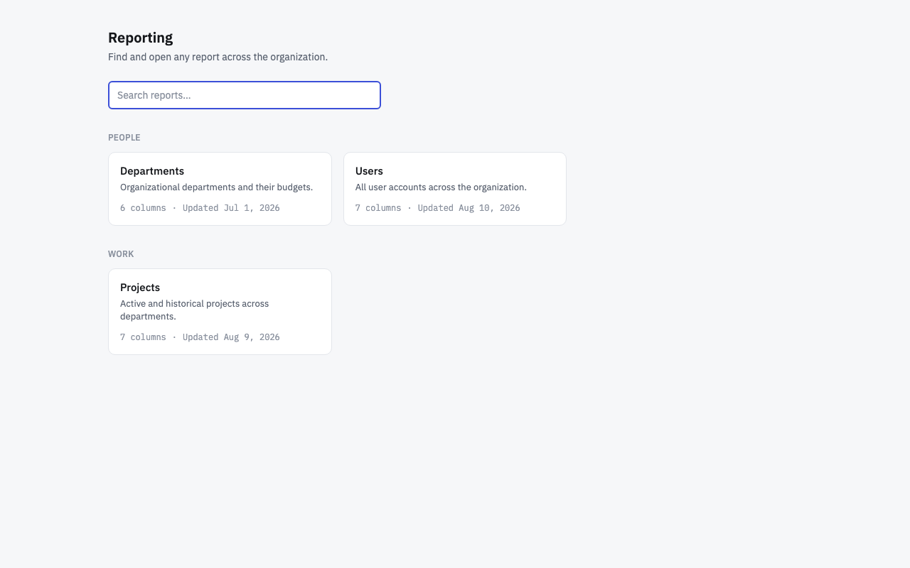
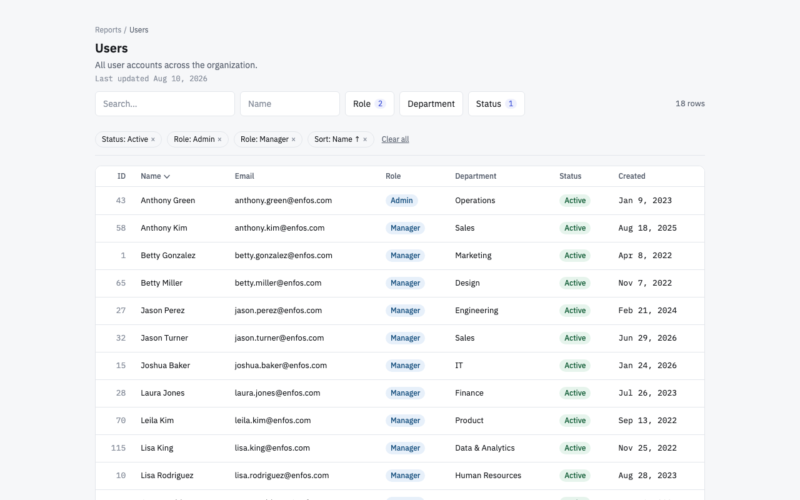

More screenshots below — states, breakpoints, and both Chromium and Firefox side by
side. Notes on What I assumed and traded off while building this:
[docs/NOTES.md](docs/NOTES.md).

<details>
<summary><strong>Full screenshot gallery (18 images: states × breakpoints × two browser engines)</strong></summary>

**States** (Chromium, desktop)

| | |
|---|---|
| Landing |  |
| Landing, instant search | 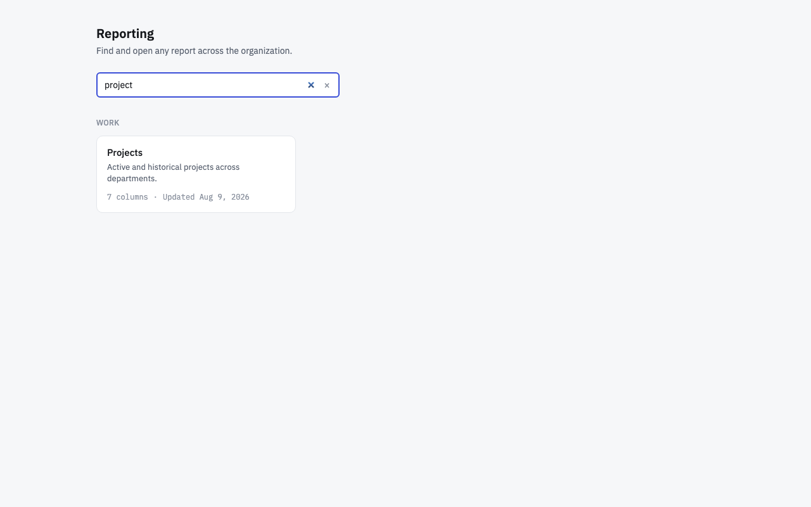 |
| Report, unfiltered | 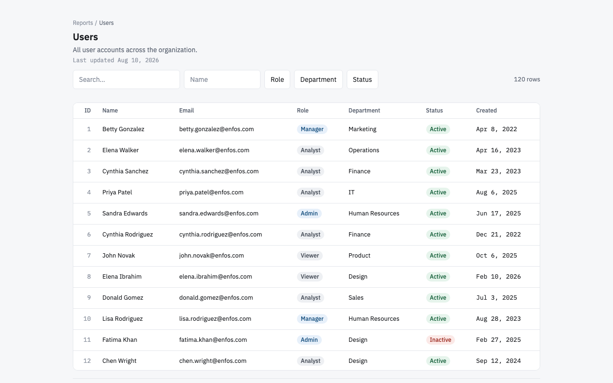 |
| Report, filtered + sorted (active query bar) |  |
| Multi-select filter dropdown open | 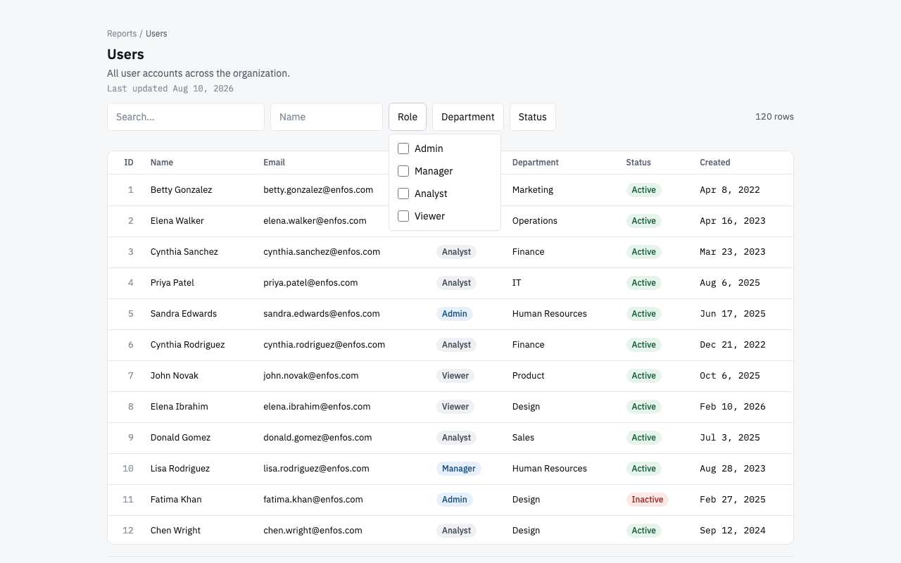 |
| Empty state — filter matches nothing | 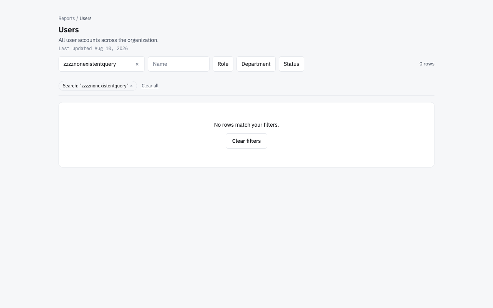 |
| Departments — fewer than one page | 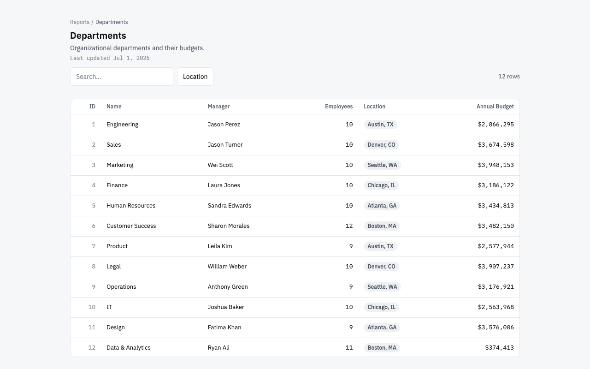 |
| Projects — nullable end date renders as — | 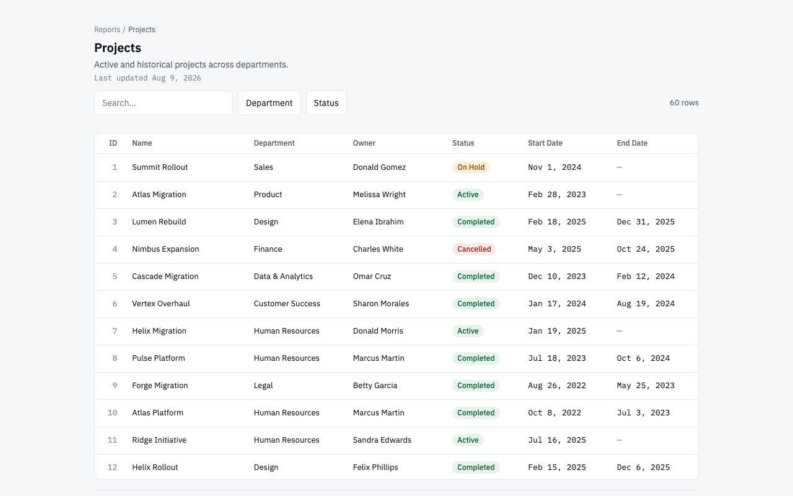 |
| Unknown report — 404 panel | 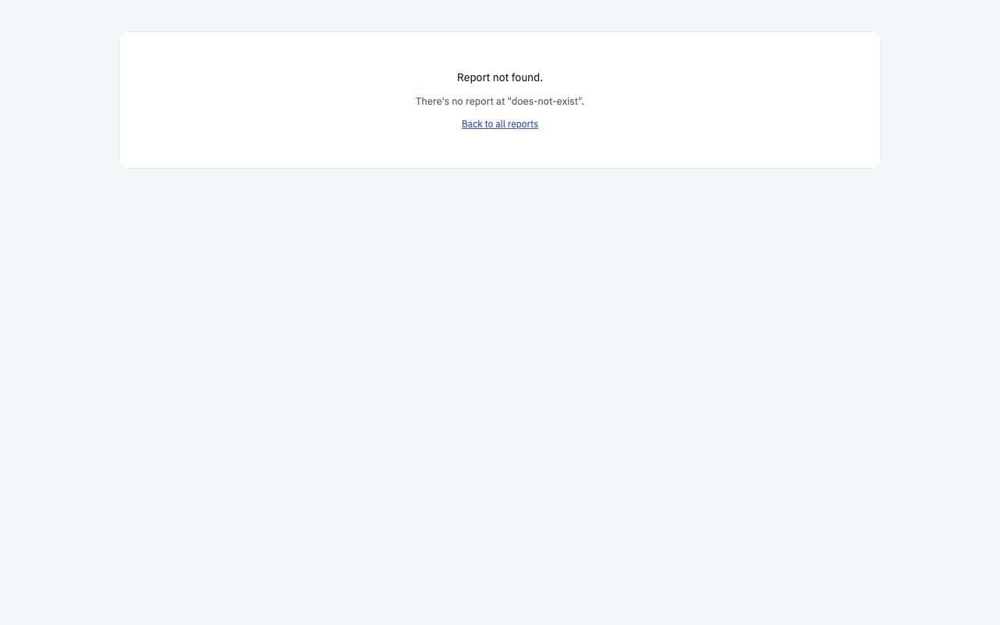 |
| Network failure — distinct from a 4xx | 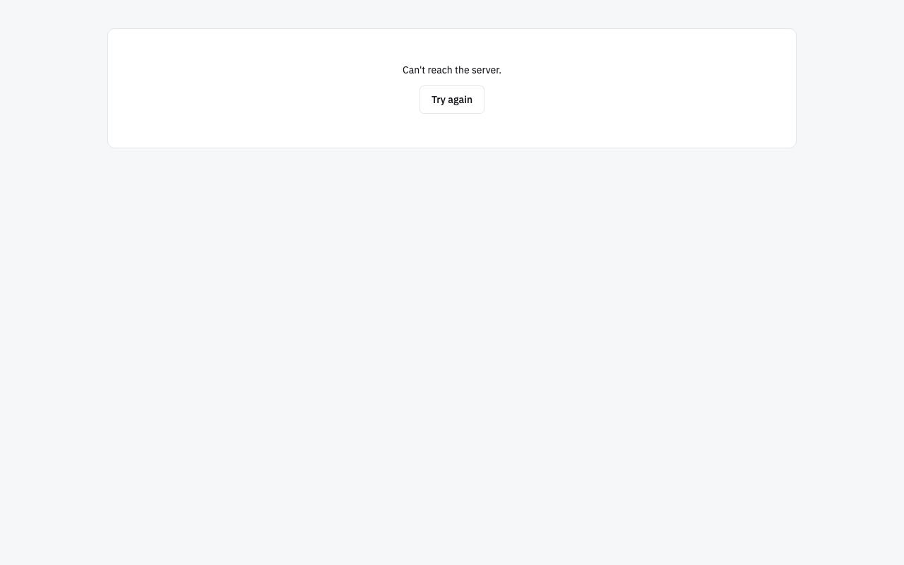 |

**Breakpoints** (Chromium)

| 768px (tablet, still table layout) | 390px (mobile, card layout) |
|---|---|
| 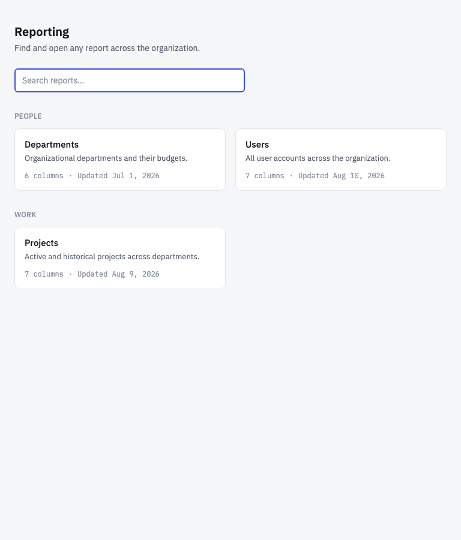 | 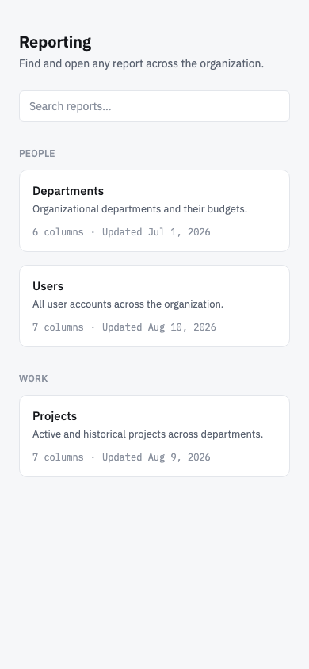 |
| 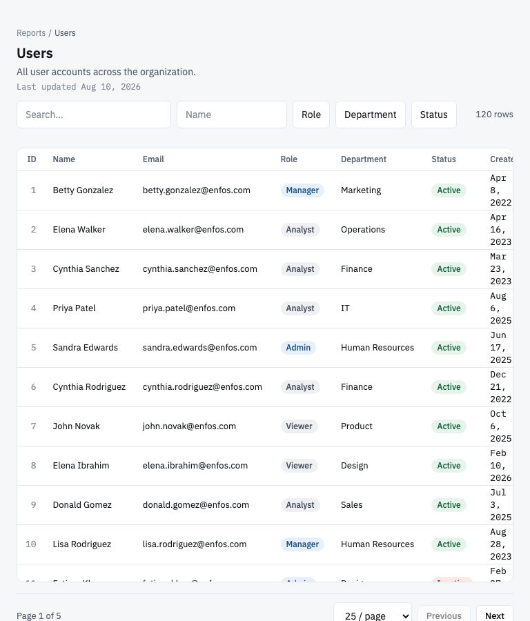 | 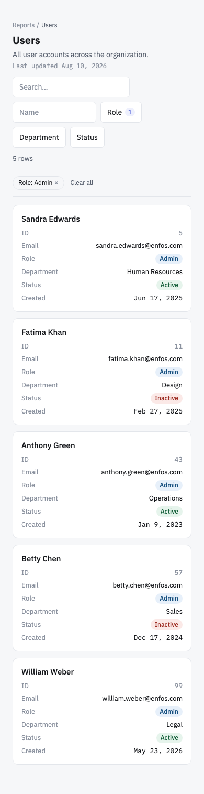 |

**Same states, Firefox** — pixel-identical to Chromium, confirming the layout doesn't
depend on one rendering engine's quirks (checked with Playwright's Firefox/Gecko build,
not just "should work in theory"):

| | |
|---|---|
| Landing | 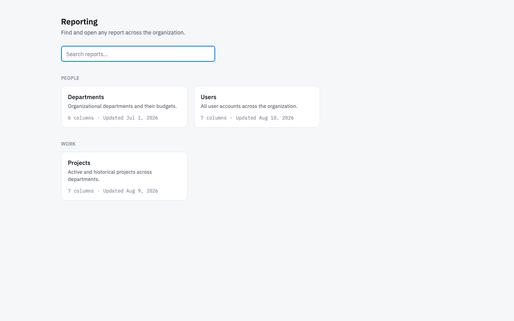 |
| Filtered + sorted | 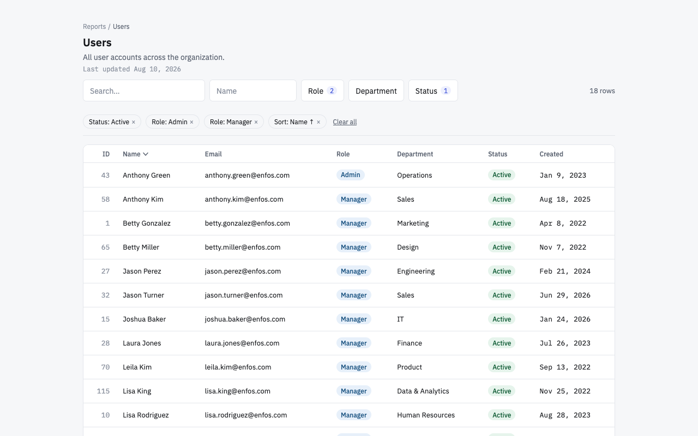 |
| Mobile landing | 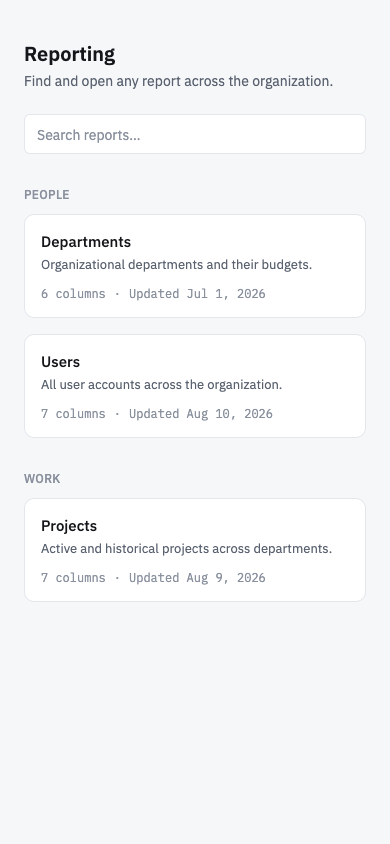 |
| Mobile filtered | 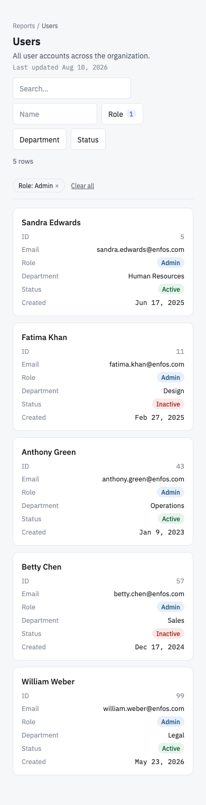 |

</details>

## Run it

One command builds and starts both the frontend and the backend no local Java,
Maven, or Node install needed, and nothing else to configure or set up first.

**Prerequisite:** Docker Engine 20.10+ with the Compose v2 plugin (bundled with current
Docker Desktop; on Linux, `docker compose version` should print `v2.x`).

```
docker compose up --build
```
(equivalently: `make up`, a thin wrapper around the same command)

Open http://localhost:3000. `Ctrl-C` then `docker compose down` (or `make down`) to stop.

This single command builds both images from their multi-stage Dockerfiles, starts the
backend, waits for its healthcheck to pass, then starts the frontend all
dependencies, environment variables, and inter-service wiring (the frontend's Nginx
config proxies `/api` to the backend container by service name) are already in
`docker-compose.yml`, `backend/Dockerfile`, and `frontend/Dockerfile`. There is no
`.env` file to create and no port to configure.

### Run without Docker

For local iteration only  not required to run the app. Prerequisites: Java 21, Node
20+ (the Maven wrapper is included, so no local Maven install is needed).

```
# terminal 1
cd backend
SPRING_PROFILES_ACTIVE=dev ./mvnw spring-boot:run

# terminal 2
cd frontend
npm install
npm run dev
```

Open http://localhost:5173. The `dev` profile enables CORS for the Vite dev server
(5173) to call the backend (8080) directly; in the Docker build there is no CORS
configuration at all, because Nginx proxies `/api` on the same origin as the built
frontend.

## Architecture

```
backend/src/main/java/com/enfos/reporting/
  api/                    controllers, DTOs, problem+json error handling
  application/            ReportService, ReportRegistry, QueryValidator
  domain/
    model/                ColumnDefinition, ReportDefinition, ReportRow, Page z
    query/                ReportQuery, FilterCriterion, SortSpec
    port/                 ReportDataSource, ReportModule — the seam
  infrastructure/
    inmemory/              the query engine: predicates, comparators, JSON seed loading
    reports/               the three concrete report modules + department options
    config/                CORS, the custom query argument resolver

frontend/src/
  api/                    typed fetch client
  hooks/                  useReportQuery (URL state), TanStack Query hooks
  components/
    ui/                   Button, Input, Select, Badge, Card, Skeleton, IconButton
    table/                DataTable, DataTableMobile, TableSkeleton, cell registry
    filters/               filter control registry
    report-detail/         toolbar, active query bar, pagination footer
  pages/                  ReportsLandingPage, ReportDetailPage, NotFoundPage
```

A report is a self-contained module: its metadata (`ReportDefinition`, describing
columns, types, and what's sortable/filterable) and its data access
(`ReportDataSource`), bundled together as a `ReportModule`. Spring collects every
`ReportModule` bean into a `ReportRegistry` at startup, which indexes them by id and
fails fast an `IllegalStateException` naming the offending id  if two modules
declare the same one.

The payoff: **adding a report is one new `@Component` class and one seed file.** No
controller change, no enum to extend, no frontend deploy the frontend renders any
report's columns generically, driven entirely by the metadata the backend sends.

## Adding a new report

This is a complete, working report module — not a sketch of one:

```java
@Component
class VendorsReportModule implements ReportModule {
    private final ReportDefinition definition;
    private final ReportDataSource dataSource;

    VendorsReportModule(JsonSeedLoader seedLoader) {
        JsonSeedLoader.SeedData seed = seedLoader.load("data/vendors.json");
        this.definition = new ReportDefinition(
            "vendors", "Vendors", "Approved vendors and their contract status.", "Operations",
            seed.lastUpdated(),
            List.of(
                new ColumnDefinition("id", "ID", ColumnType.ID, true, false, FilterType.NONE, List.of()),
                new ColumnDefinition("name", "Name", ColumnType.TEXT, true, true, FilterType.TEXT, List.of()),
                new ColumnDefinition("status", "Status", ColumnType.ENUM, true, false, FilterType.ENUM,
                    List.of(new EnumOption("ACTIVE", "Active"), new EnumOption("EXPIRED", "Expired")))
            ));
        this.dataSource = new InMemoryReportDataSource(seed.rows());
    }

    @Override public ReportDefinition definition() { return definition; }
    @Override public ReportDataSource dataSource() { return dataSource; }
}
```

Drop `vendors.json` into `backend/src/main/resources/data/` — `{ "lastUpdated": "2026-08-10",
"rows": [ { "id": 1, "name": "...", "status": "ACTIVE" }, ... ] }`, one object per row,
keyed by the column keys above — and the report appears on the landing page, sorts,
filters, and paginates, with its "last updated" date sourced from that same file. Zero
other changes.

## Swapping the data source

`ReportDataSource` is the port:

```java
public interface ReportDataSource {
    Page<ReportRow> fetch(ReportDefinition definition, ReportQuery query);
}
```

`InMemoryReportDataSource` is the only adapter today. A JDBC adapter would implement the
same interface — translating `ReportQuery`'s filters and sorts into a `WHERE`/`ORDER BY`
clause and running it against a table — and the application and API layers would not
change at all.

Query validation deliberately lives in the **application** layer
(`QueryValidator`), not in any adapter. Filter keys, sort keys, and sort directions
arrive as user-controlled strings that would land in SQL identifier position in a JDBC
adapter — a place bind parameters cannot protect. Validating centrally, against exactly
the report's declared `ColumnDefinition`s, means every present and future adapter
inherits that guarantee automatically. An adapter author cannot forget to check what a
request is asking to touch, because it never sees an unvalidated query.

## API reference

Base path: `/api/reports`.

- `GET /api/reports` — list every report's summary (id, name, description, category, last-updated date, column count).
- `GET /api/reports/{reportId}/metadata` — that report's full column definitions. Emits
  an `ETag`; a matching `If-None-Match` gets a `304`.
- `GET /api/reports/{reportId}` — row data. Query params:
  - `page` (default `0`), `size` (default `25`, max `200`)
  - `sort=columnKey,direction` — repeatable, direction optional (defaults to `asc`), e.g. `sort=name,asc&sort=status,desc`
  - `search` — free text across the report's searchable columns
  - `filter.<columnKey>=v1,v2` — comma-separated values are OR'd within a column; separate `filter.*` params are AND'd across columns

Collection responses are an envelope: `{ "data": [...], "page": { number, size,
totalElements, totalPages, hasNext, hasPrevious } }`. Errors are RFC 9457
`application/problem+json`, always carrying a `traceId` that's also written to the
server log, so a support request can be traced back to the exact log line.

```
curl 'localhost:8080/api/reports/users?sort=name,asc&filter.status=ACTIVE&size=5'

curl -i 'localhost:8080/api/reports/nope'
# HTTP/1.1 404
# Content-Type: application/problem+json
# {"type":"/problems/report-not-found","title":"Report not found","status":404,
#  "detail":"No report found with id 'nope'.","instance":"/api/reports/nope",
#  "traceId":"..."}
```

## Deliberately out of scope

- **Auth and RBAC** — every report is visible to every caller. A real deployment would
  add a Spring Security filter chain and per-report authorization checks in
  `ReportService`; nothing in the port design blocks that.
- **CSV export** — would be a new controller endpoint reusing the same validated
  `ReportQuery` and streaming `ReportRow`s through a CSV writer instead of JSON.
- **Column visibility persistence** — no per-user preference storage exists yet; would
  need a user identity to key it on, which auth doesn't exist for either.
- **Virtualized rows** — at 25–200 rows per page this isn't a performance problem yet.
  Worth adding if a report's max page size grows substantially.
- **A caching tier** — the in-memory adapter is already as fast as caching would make
  it. A real JDBC adapter behind a slow database is where a cache would earn its keep.
- **A live JDBC adapter** — the port is designed for it (see "Swapping the data
  source"), but building and testing one was out of scope for this exercise.

## Testing

The query engine (`RowPredicateFactory`, `RowComparatorFactory`,
`InMemoryReportDataSource`) is the highest-value suite in the project and is tested most
thoroughly: search-vs-non-searchable columns, OR-within/AND-across filters, ascending and
descending sort, nulls-last in both directions, and — the one that actually catches
bugs — a fixture built so a tie in sort key spans a page boundary, proving the stable
tiebreaker prevents rows from being skipped or duplicated across pages.

Above that: domain model validation (invalid `ColumnDefinition`/`ReportDefinition`
constructions fail fast), `QueryValidator` (every violation type, and that multiple
violations are collected together rather than failing on the first), `ReportRegistry`
(duplicate ids), and `@WebMvcTest` slices for the controller's HTTP contract (shape,
404, 400, ETag/304). An `@SpringBootTest` integration test asserts all three seeded
reports load with the right row counts and that every cross-reference (project owner,
department manager) resolves to a real user — the referential-integrity guarantee the
seed data promises.

The frontend has no automated test suite; TypeScript strict mode plus manual
browser verification (every interaction in this README's screenshots, plus the mobile
layout, keyboard navigation, and the Docker build) stood in for it here. Given more time,
component tests for the cell/filter registries and the query-state hook would be the
first addition.
